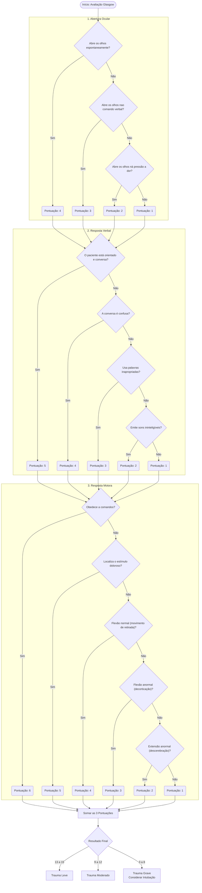

```mermaid
flowchart TD
    Start([Início: Avaliação Glasgow]) --> Q1

    %% --- BLOCO 1: ABERTURA OCULAR ---
    subgraph Ocular [1. Abertura Ocular]
        direction TB
        Q1{"Abre os olhos espontaneamente?"}
        Q2{"Abre os olhos nao comando verbal?"}
        Q3{"Abre os olhos nà pressão a dor?"}
        
        Q1 -- Sim --> AO4(Pontuação: 4)
        Q1 -- Não --> Q2
        Q2 -- Sim --> AO3(Pontuação: 3)
        Q2 -- Não --> Q3
        Q3 -- Sim --> AO2(Pontuação: 2)
        Q3 -- Não --> AO1(Pontuação: 1)
    end

    AO4 & AO3 & AO2 & AO1 --> Q4

    %% --- BLOCO 2: RESPOSTA VERBAL ---
    subgraph Verbal [2. Resposta Verbal]
        direction TB
        Q4{"O paciente está orientado e conversa?"}
        Q5{"A conversa é confusa?"}
        Q6{"Usa palavras inapropriadas?"}
        Q7{"Emite sons ininteligíveis?"}

        Q4 -- Sim --> RV5(Pontuação: 5)
        Q4 -- Não --> Q5
        Q5 -- Sim --> RV4(Pontuação: 4)
        Q5 -- Não --> Q6
        Q6 -- Sim --> RV3(Pontuação: 3)
        Q6 -- Não --> Q7
        Q7 -- Sim --> RV2(Pontuação: 2)
        Q7 -- Não --> RV1(Pontuação: 1)
    end

    RV5 & RV4 & RV3 & RV2 & RV1 --> Q8

    %% --- BLOCO 3: RESPOSTA MOTORA ---
    subgraph Motora [3. Resposta Motora]
        direction TB
        Q8{"Obedece a comandos?"}
        Q9{"Localiza o estímulo doloroso?"}
        Q10{"Flexão normal (movimento de retirada)?"}
        Q11{"Flexão anormal (decorticação)?"}
        Q12{"Extensão anormal (descerebração)?"}

        Q8 -- Sim --> RM6(Pontuação: 6)
        Q8 -- Não --> Q9
        Q9 -- Sim --> RM5(Pontuação: 5)
        Q9 -- Não --> Q10
        Q10 -- Sim --> RM4(Pontuação: 4)
        Q10 -- Não --> Q11
        Q11 -- Sim --> RM3(Pontuação: 3)
        Q11 -- Não --> Q12
        Q12 -- Sim --> RM2(Pontuação: 2)
        Q12 -- Não --> RM1(Pontuação: 1)
    end

    RM6 & RM5 & RM4 & RM3 & RM2 & RM1 --> Soma

    %% --- RESULTADO ---
    Soma[Somar as 3 Pontuações] --> Classificacao{Resultado Final}
    
    Classificacao -- 13 a 15 --> Leve[Trauma Leve]
    Classificacao -- 9 a 12 --> Mod[Trauma Moderado]
    Classificacao -- 3 a 8 --> Grave[Trauma Grave\nConsiderar Intubação]

    %% --- ESTILOS ---
    classDef yes fill:#d5f5e3,stroke:#2ecc71,stroke-width:2px;
    classDef no fill:#fadbd8,stroke:#e74c3c,stroke-width:2px;
    classDef score fill:#ebf5fb,stroke:#3498db,stroke-width:2px;

    %% Link Styles podem variar dependendo do renderizador, mas o código acima é seguro

```
